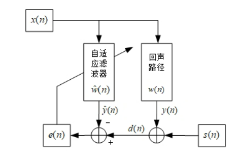

无论是在空旷的屋子还是幽深的山谷，我们都很容易听到回声。回声虽然听着很好玩，但是在一些场景中却必须要去除回声，比如免提电话、电话会议系统等情形。本文将主要讨论回声消除算法的归一化最小均方算法（Normalized Least Mean Square）。

声学回声信号根据传输途径的差别可以分别**直接回声**信号和**间接回声**信号：
+ 直接回声（线性回声）：近端扬声器将语音信号播放出来后，被近端麦克风直接采集后得到的回声。直接回声不受环境的印象，与扬声器到麦克风的距离及位置有很大的关系，因此直接回声是一种线性信号。
+ 间接回声（非线性回声）：近端扬声器将语音信号播放出来后，语音信号经过复杂多变的墙面反射后由近端麦克风采集；间接回声的大小与房间环境、物品摆放以及墙面吸引系数等等因素有关，因此间接回声是一种非线性信号。在实际应用中，设备的扬声器和麦克风等电子元器件失真也会导致一定的非线性信号。

需要说明的是，(N)LMS算法主要解决的还是线性回声的问题，非线性回声部分是无法通过线性自适应滤波消除的。正文开始前，我们需要先明白几个概念。假设你和你的朋友A打电话。对于你来说，你这端是近端，A那端是远端，A那边说话被麦克风采集的信号$x(n)$发送到你这边，这个$x(n)$就是远端信号；你这边的麦克风采集到的信号叫期望信号$d(n)$。远端信号被你这边的扬声器播放又被你这边的麦克风采集，这中间信号会发生一些变化，这个过程可以看作远端信号$x(n)$经过一个系统$w(n)$成为了麦克风采集的信号(注意信号与系统之间的相互作用用卷积表示)。当你说话时，又产生一个信号$s(n)$。所以期望信号$d(n)$可以认为(忽略图中远端信号播放出来后被反射导致的回声$y(n)$)：
$$
d(n)=s(n)+x(n)*w(n)
$$

<!-- 一个完整的回声消除系统，需要实现以下四种
时延估计（Time Delay Estimation, TDE） 模块
(线性)回声消除（Linear Acoustic  Echo Cancellation, AEC） 模块
双讲检测（Double-Talk Detect, DTD） 模块
(非线性)残余声学回声抑制（Residual Acoustic Echo Suppression, RAES） 模块 -->

>其中，我们可以得到两个信号：一个是蓝色和红色混合的信号1，也就是实际需要发送的speech和实际不需要的echo混合而成的语音流；另一个就是虚线的信号2，也就是原始的引起回音的语音。那大家会说，哦，原来回声消除这么简单，直接从混合信号1里面把把这个虚线的2减掉不就行了？请注意，拿到的这个虚线信号2和回音echo是有差异的，直接相减会使语音面目全非。我们把**混合信号1叫做近端信号ne**，**虚线信号2叫做远端参考信号fe**，如果没有fe这个信号，回声消除就是不可能完成的任务，就像“巧妇难为无米之炊”。

  

## 基于LMS[^1]算法的AEC算法的C++实现

上面的μ为**固定步长因子**，μ的大小很大程度上决定了算法的收敛与稳态性能。μ越大，算法收敛越快，但稳态误差也越大；μ越小，算法收敛越慢，但稳态误差也越小。

归一化最小均方（NLMS）算法是LMS算法的一个扩展，利用**可变的步长因子代替固定的步长因子，就得到了NLMS算法**，它通过计算最大步长值μ绕过了这个问题。
$$
\mu(n)=\frac{\tilde{\mu}}{x(n)^{2}}
$$
其中$\tilde{\mu}$是自适应常量，取值在0~2。**在写程序时发现，使用NLMS时，有些地方信号能量太小，导致$\mu$变得很大，针对这个问题，书上写的方法是在分母上面加上一个常量以防止能量太小，树上的例程里面的常量是0.001[^2].**

自适应滤波器的迭代：
$$
w(n+1)=w(n)+\mu(n) x(n) e(n)
$$
两种算法收敛的比较：
  
 
