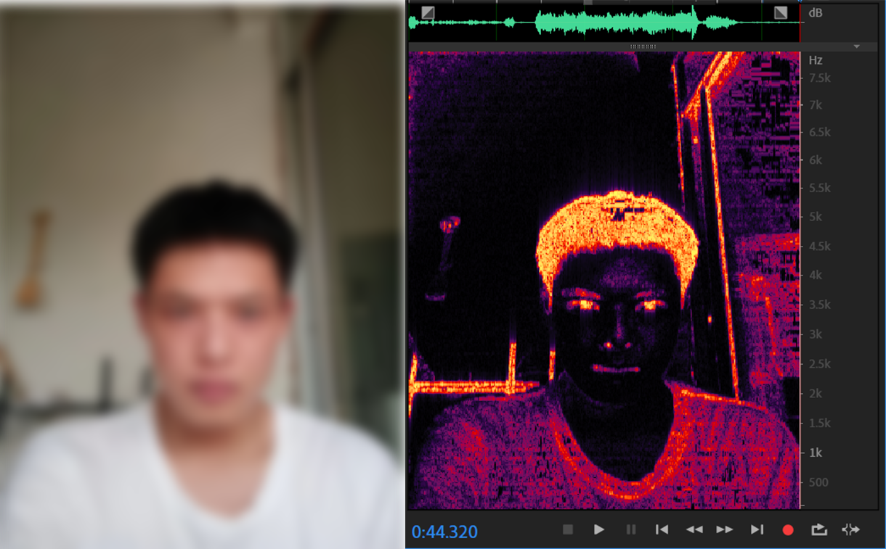
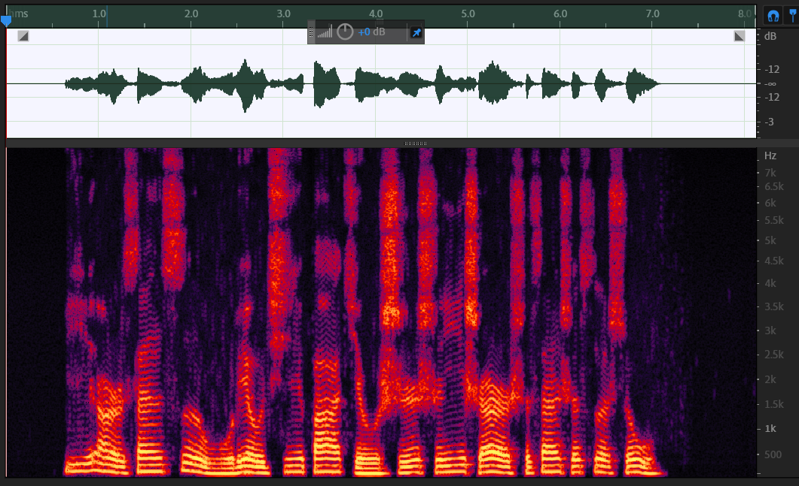

第一次接触到声谱图，在声谱图上编辑音频的时候，我就在想如果我在声谱图上编辑出各种图案，最终的音频会变成什么样子？前一阵子在某平台上看到一篇文章，里面说到某次演唱会上一个歌手就把自己的头像放进了自己的歌曲的最后一段里，并在最后突然显示出来。这听起来真是一件很有趣的事。最近我就用python实现了一个程序，把自己的自拍照转为音频，并且让音频能比较清晰的播放出有意义的声音······

## 效果展示

 
如图所示，我把左边的图片转为了一段音频，该音频用Adobe audition打开后可以在声谱图中看到原来的图片。同时我在从图片构建音频时，使用了一段说话的录音，使得构建的音频也是能依稀听见说话声的，而不是一段毫无意义的噪音。


## 原理简介

众所周知，对一段语音信号进行傅里叶变换可以让我们得到信号的频谱，看到信号中的各种频率成分。通常情况下，我们不仅需要看到信号中的各种频率成分，而且需要知道各种频率出现的时间。在这种需求下，对一个完整的信号进行傅里叶变换自然是不可行的，于是便出现基于短时傅里叶变换的声谱图。如下图所示，横坐标表示时间，纵坐标表示频率，每一个点上的颜色深浅则代表对应时间对应频率成分的强弱。

  

声谱图是怎么来的呢？对一段长语音信号，进行预加重、分帧、加窗，再对每一帧做傅里叶变换，之后把每一帧的结果沿着时间维度排列，就得到了声谱图。显然，声谱图的格式类似于灰度图，我们可以把任意的灰度图视作声谱图，然后把这个过程反着来一遍，就得到一段音频信号。

预加重是为了对语音中被抑制的高频部分进行补偿，去除口唇辐射的影响，增加语音的高频分辨率。通常使用的方法是把信号通过一个一阶的高通FIR滤波器，其差分方程为：

$$
y(n)=x(n)-\alpha*x(n-1),      0.9<\alpha<1.0
$$

分帧是把一段长信号分成一帧帧的短信号，每一帧信号的长度一般取20~50ms，对每一帧信号做傅里叶变换便是短时傅里叶变换（STFT）。帧长越短意味着能在更精细的时刻知道有哪些频率成分，可是这也会导致对信号做快速傅里叶变换时频率的精度降低，所以帧长要合适。分帧的时候不仅要注意帧长，也要注意帧移。帧移是相邻两帧的间隔。比如我第一帧取0~25ms，第二帧可以取10~35ms，也可以取20~45ms，它们对应不同的帧移。帧移是为了减小加窗带来的影响。

加窗是为了减小频谱的泄露。计算机只能处理离散的信号，所以我们使用的傅里叶变换是离散傅里叶变换（DFT）。DFT的频域是离散的，频域的离散对应着时域的周期延拓。试想在音频中截取某一帧信号，对这个信号做周期性延拓。如果延拓的信号正好是原来的音频，那么直接对这一帧信号做DFT不会有任何问题。但是大多数情况下，延拓之后，信号最右端的点和信号最左端的点不会是连续的，会带来一个陡然的变化，这边会引入高次谐波，导致频谱泄露。通过对信号加窗，也即信号和窗函数相乘，就可以减小延拓后的信号中的突变，减小频谱泄露。一个典型的窗函数如图：
  

不难发现，窗函数和信号相乘后，每帧信号两端都被不同程度的抑制了，为了减小这种情况的影响，便需要使得相邻两帧是帧间交叠的，也即上面所说的设置帧移。

将图片转为音频是上面所说的求声谱图的逆过程，而分帧的逆过程自然是合帧。合帧的方法是重叠相加法（overlap add），顾名思义，就是把分帧的时候帧间交叠的部分在合帧的时候直接相加，这样即可重建原来的信号。


## 编程实现

首先，读取一个图片，图片的每一列视为每一帧音频的幅频响应。fft算出的幅频响应是对称的。这意味着要调整图片的高度，以便重建对称的那一半幅频响应。我调整高度的方法时把其高度转为最接近实际高度的2的幂次加一：
```python
data=cv2.imread(img)

origin_width=data.shape[0]
origin_height=data.shape[1]

tar_h=find_min_pow(origin_height)+1
ratio=origin_height/tar_h
tar_w=int(origin_width/ratio)

data=cv2.resize(data,dsize=(tar_w,tar_h),fx=1,fy=1,interpolation=cv2.INTER_LINEAR)
```
接着，把图片从彩色图片转为灰度图片，然后调整每一个像素的值，以使得最终的声谱图具有区分度(我并没有找到一个很好的调整方法，下面的像素调整可自行修改)。
```python
# 用对rgb通道求平均值的方法转为灰度值
data=np.mean(data,axis=2)
# 调整每一个像素的值，采样宽度是16位的，所以最终的每个音频数据在-0x7fff~0x7fff之间。
data=256-data
data=data-128
data[data<0]=data[data<0]-20
data[data>=0]=data[data>=0]+20

data=data**5
data=data/(np.max(data)/0x7fff)
```
接下来构建另一半的幅频响应：
```python
# 上下翻转一下图片
data=data[::-1,:]

data=np.r_[data,data[-2:0:-1,:]]
```
幅频响应有了，相频响应怎么办呢？我们可以不考虑相频响应，直接反变换，这意味着默认相频响应为0。最终得到的音频则是一段无意义的噪声。我的处理方法是：引入另一段音频，按合适的大小求其声谱图，保留其相频响应，作为我们的图片的相频响应。 这样得到的音频能够很大程度的保留引入的音频的内容，而不是无意义的噪声。
```python
# 获取相频响应
pha=get_phase('./sing.wav',data.shape[0],(data.shape[0],data.shape[1]))
# 把相频响应添加到幅频响应，得到完整的fft频谱
data=data*np.exp(1j*pha)
# 对完整的频谱反变换得到分帧后的音频数据
nd=np.fft.ifft(data,axis=0)
```
在合帧之前，加一下窗，不然最终的音频会有比较严重的频谱泄露：
```python
# 加窗
for i in range(nd.shape[1]):
    nd[:,i]=nd[:,i]*np.hanning(nd.shape[0])
```
合帧，导出完整音频：
```python
audio=au.comframe(nd.T,inc=nd.shape[0]//4)
au.audio_export(audio,'target.wav')
```

over~

---

