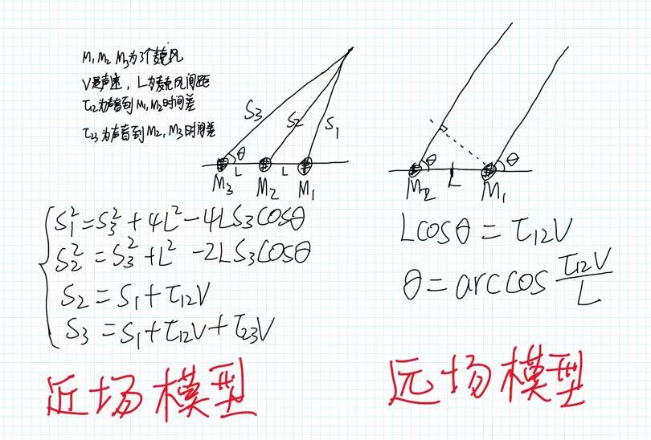

前几天工作中发现DOA这东西挺好玩的，于是这两天在做声源方向估计的工作，我使用GCC-PHAT(广义互相关-相位变换)实现了声源方向估计，遗憾的是，由于条件所限，只实现了双麦克风下的声源估计。。。

在讲原理和算法实现之前，先看看效果图吧！左上角麦克风实时采集的左声道和右声道的音频时域波形。左下角是实时计算出来的广义互相关，而右边就是预测出来的音频入射角度。测试发现效果还是差强人意的。
 

在对声源方向估计时，由声源和麦克风的距离远近可以分为近场和远场模型，如果声源和麦克风的距离$r$小于$\frac{2L^2}{λ}$便认为是近场模型(L是麦克风间距，λ是音频波长)，反之便认为是远场模型。在近场模型中，声源到达麦克风阵列的波形视为球面波。此时若麦克风的数量不少于3个，不仅可以确定声源的方向，还可以确定声源的位置(如下图所示，解出方程即可求得方向和距离)。在远场模型中，声源到麦克风的波形视为平面波，有两个麦克风，就能确定声源的方向。


通常情况下麦克风的间距也就是几厘米，由上面提到的判断远场近场的公式不难算出我们遇到的基本都是远场模型的情况。从上面的图片中的计算可以发现，无论近场远场，有一个量是我们必须实时计算的，即音频到不同麦克风的时间差。本文使用的估计这个时间差的方法就是GCC-PHAT（广义互相关-线性变换法）。

广义互相关函数为:

$R_{x_{1} x_{2}}(t)=\int_{0}^{\pi} \varphi_{12}(\omega) X_{1}(\omega) X_{2}^{*}(\omega) e^{j \omega t} d \omega$

其中$\varphi_{12}(\omega)$表示频域加权函数。PHAT是GCC常用加权函数中的一个，该函数为：

$\varphi_{12}(\omega)=\frac{1}{\left|G_{x, x_{2}}(\omega)\right|}=\frac{1}{\left| X_{1}(\omega) X_{2}^{*}(\omega)\right|}$

我们要求的就是找到一个t使得$R_{x_{1} x_{2}}(t)$最大（ $\underset{t}{\operatorname{argmax}} R_{x_{1} x_{2}}(t)$ ）。从上面远场模型的图中不难发现，t的范围在$(-\frac{L}{v},\frac{L}{v})$之间(v是声速)。

下面就是如何用python实现核心代码了。首先是根据时域信号求频谱，该共轭的共轭。

```python
    spec1=np.fft.fft(s1)
    spec2=np.fft.fft(s2)
    spec2=spec2.conj()
```
再就是根据频域加权函数计算各个频率的权值。此处就是我还没有弄明白的地方了，按照公式，PHAT权值的计算是`1/np.abs(spec1,spec2)`，可是这样的实现效果很差，换成`1/(np.abs(spec1)*np.abs(spec2))`就好多了。

```python
    # fweight=1/np.abs(spec1,spec2)
    fweight=1/(np.abs(spec1)*np.abs(spec2))
```
看着上面的计算GCC的公式，我们先把$wt$算一下：

```
    # 时域范围
    max_time_diff=dis_of_mic/sound_speed
    time_range=np.array([np.linspace(-max_time_diff,max_time_diff,1024)]).T*fs 

    phase=2*np.pi/fft_len*np.array([np.arange(fft_len)])
    phase=time_range*phase
```
可以计算GCC了：

```python
    Rxy=np.dot(1j*np.exp(phase),np.array([fweight*spec1*spec2]).T)
    
    Rxy=np.real(Rxy)
```
根据GCC很容易计算声音的入射方向：
```
    index=np.argmax(Rxy)
    td=time_range[index,0]/fs
    theta=np.arccos(td*sound_speed/dis_of_mic)
```