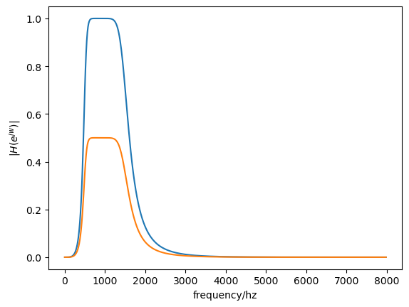

几个月前，看到一个开源的Rnn降噪程序，我对其作了修改对一个带噪音频进行降噪，发现效果真的比传统的降噪算法（webrtc中的降噪模块）好了很多。当时看着挺复杂的，我没有深究它的原理，几个星期前总监让我做一个自研的Rnn降噪程序，我查询了一些资料，发现Rnnoise的设计真的挺自然而精妙的...

设想以下你有两个音频，其中一个是纯净的语音音频，另一个是把它混杂了一些噪声后得到的对应带噪语音。考虑到语音的短时平稳性，我们把这两个音频分成一帧帧的处理。对于这两个语音的每一帧（20~50ms为一帧）做fft后对于每一个频点我们可以算出加入噪声前后其频率响应增强或衰减了多少倍。这样只需要对带噪语音帧的每一个频点的频率响应乘以相应的系数，就可以达到降噪的效果。又考虑到对每一个频点处理，运算量太大，我们可以分成一个个频带，每个频带设计一个带通滤波器，构成了一个带通滤波器组，计算出每一个频带在加入噪声前后的能量增加或衰减了多少倍，将其作为带通滤波器组的增益，应用到这个频带的带通滤波器上，也可以实现降噪（虽然效果差了点）。这个过程看起来像是脱裤子放屁，但是Rnnoise做的就是在有且仅有带噪语音的情况下去估计带通滤波器组的每一个带通滤波器的增益，对信号进行带通滤波，从而实现降噪。

先说这个带通滤波器的设计。无论是在matlab还是python中，设计一个数字滤波器都是一个很简单的事情，如：
```python
import scipy.signal as sig
import numpy as np
import matplotlib.pyplot as plt
# 设计一个4阶的巴特沃斯滤波器
b,a=signal.butter(4,[500,1500],'bandpass',fs=16000)
# ------------------------
w,h=sig.freqz(b,a,fs=16000)
plt.plot(w,np.abs(h))
# 调整通带增益，衰减了20*np.log10(0.5) dB
b=b*0.5
w,h=sig.freqz(b,a,fs=16000)
plt.plot(w,np.abs(h))

plt.xlabel('frequency/hz')
plt.ylabel("$|H(e^{jw})|$")
plt.show()

```
  

一个4阶的通带边沿频率为500hz、1500hz的数字带通滤波器就设计好了。如上所示，通过对滤波器分子多项式系数乘以一个0~1之间的数字，就可以调整通带增益。从系统函数可以球的差分方程，根据差分方程就可以编写这一部分的c语言程序了。

需要思考的另一个问题是，这个带通滤波器组要如何分配到全频率上，即每一个带通滤波器的通带截止频率该设置为多少。通常我们很容易想到，把0-8000hz均分为指定个数的频带。但是这并不是一个好方法，但是这并不是一个好方法，因为人耳对频率的感知是非线性的，在低频段，人耳对频率的感知比高频更加灵敏，所以滤波器组在低频的分布应当更加密集。更合理地布置滤波器组的分布的方法就是在巴克尺度或者梅尔尺度下划分。巴克(bark)频率尺度是以Hz为单位，把人耳能听到的频率映射到心理声学的24个临界频带上，第25个临界频带占据约：16K~20kHz的频率，1个临界频带的宽度等于一个Bark.

> 根据相关的心理声学的研究，由于人耳的特殊结构，在同一个临界频带里头信号容易发生掩蔽效应，即：主要信号容易被能量大并且频率接近的掩蔽信号所掩蔽。因此我们可以认为Bark域约近的信号越容易产生掩蔽效应。

巴克尺度使用起来灵活性差,比如我处理的音频是16khz采样率的,使用巴克尺度的话,我的滤波器组个数必须为22.我若是想简化模型,加快速度,减小滤波器组个数是一个很好的方法,但是使用巴克尺度我并不能更改滤波器组个数.所以我使用的是梅尔尺度.梅尔尺度是一种基于人耳对等距的音高变化的感官判断而定的非线性频率刻度，和频率的赫兹的关系如下:$m=2595*log_{10}(1+f/700)$. 人耳对梅尔频率的感知是线性的,这意味着我们可以在梅尔尺度下把频率范围均分为指定个数的频带,在变换到普通的频率尺度下.

---

至于网络的设计这一块儿,网上有很多的讲解,可惜它们基本都是用keras的,当时找半天没找到一个使用pytorch实现的网络.所以我只好照葫芦画瓢自己用pytorch写了.网络的结构如下图所示:

  

这个网络基本是有全连接层和门控循环单元组成,不算太复杂.其输入是每一帧带噪语音的特征,这个特征的可以自行选择,fbank.mfcc及一阶二阶差分都行.网络的输出有两个,一个是vad,一个就是滤波器组中每个滤波器的增益(图中的网络估计就是基于巴克尺度设计的,所以输出维度是22).如果你也想使用pytorch实现该网络,不妨在github寻找对应的keras实现,结合上图自行编写.

over~~